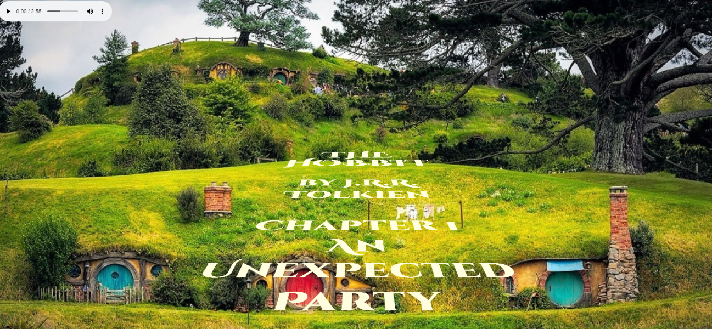

# scrolling-text
An example of scrolling text using HTML5 and CSS3 (using keyframes and the animation property).
 

Inspired by [Net Ninja's](https://github.com/iamshaunjp) tutorial, [Star Wars Scrolling Text Tutorial (CSS Animation)](https://youtu.be/kHrV2ZHzF-0), I decided to do a Middle-earth take on the iconic scrolling text seen in early Hollywood serials of the 30's and 40's and, of course, **Star Wars**.  
Be sure to push :arrow_forward: on the audio player in the upper-left.

Find the app deployed here => (https://steeshmck.github.io/scrolling-text/)

